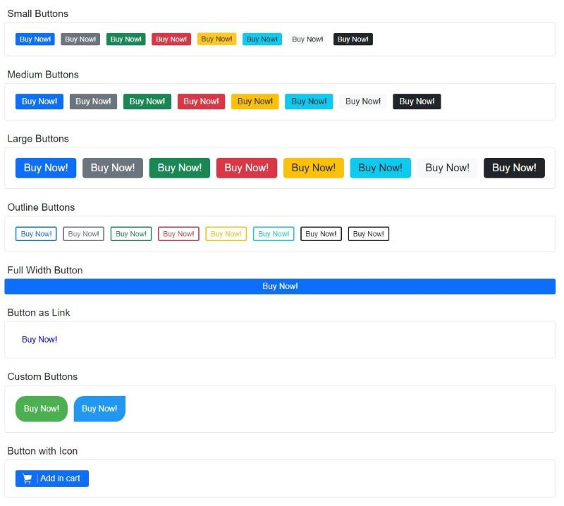

# button-ui

A reusable React button component library, inspired by Bootstap 5 library!

## Example



## Installation

```shell
npm install button-ui
```

## Importing the component into your React project

```js
import { Button } from "@gdmichelis/button-ui";
```

## Usage

This library offers two ways to style your button:

### 1st way - Predefined button

```js
// You can make use of the $variation and $size predefined props to style your button
// $variation values are "primary", "secondary", "success", "warning", "danger", "info", "light", "dark"
// $size value can be "large", "medium", or "small"
```

```js
//App.tsx
import Button from "@gdmichelis/button-ui";

function App() {
  return (
    <>
      //... other code
      <Button $variation="primary" $size="medium">
        Submit
      </Button>
    </>
  );
}
```

### 2nd way - Custom button

```js
// Here you can specify any HTML button element css style property, by prepend the $ sign,
// e.g. $borderRadius = "7px" for css border-radius: 7px;
// This button supports all native HTML button attributes like e.g. tabindex (-> tabIndex in JS)
```

```js
//App.tsx
import Button from "button-ui";

function App() {
  return (
    <>
      //... other code
      <Button
        $background="#4CAF50"
        $color="#fff"
        $borderRadius="20px"
        $padding="1rem"
      >
        Submit
      </Button>
    </>
  );
}
```

### Fully customisable

As a button content you can pass from text, icon, or text & icon combination.

```js
//App.tsx
import Button from "button-ui";

function App() {
  return (
    <>
      //... other code
      <Button
        $background="#4CAF50"
        $color="#fff"
        $borderRadius="20px"
        $padding="1rem"
        onClick={() => alert("Added to cart!")}
      >
        <svg
          height="20px"
          width="20px"
          fill="#fff"
          version="1.1"
          id="_x32_"
          xmlns="http://www.w3.org/2000/svg"
          xmlnsXlink="http://www.w3.org/1999/xlink"
          viewBox="0 0 512 512"
          xmlSpace="preserve"
        >
          <g>
            <path
              d="M491.615,95.732c-5.051-6.18-12.624-9.78-20.622-9.78H123.655l-11.827-40.616l-0.009-0.025
    c-5.434-18.177-20.341-31.939-38.883-35.912L30.487,0.297c-7.2-1.537-14.28,3.039-15.817,10.23
    c-1.536,7.182,3.039,14.271,10.231,15.808l42.449,9.101c9.05,1.935,16.309,8.651,18.958,17.506l77.589,266.549
    c-1.749,0.814-3.43,1.706-5.06,2.674c-8.371,4.984-15.077,11.979-19.577,20.147c-4.296,7.768-6.588,16.564-6.801,25.639h-0.042
    v1.384h0.034c0.178,7.08,1.68,13.89,4.313,20.095c4.194,9.916,11.172,18.313,19.968,24.264c8.796,5.943,19.476,9.433,30.86,9.424
    h249.57c7.361,0,13.32-5.96,13.32-13.312c0-7.352-5.96-13.321-13.32-13.321h-249.57c-3.982,0-7.7-0.79-11.104-2.233
    c-5.102-2.156-9.492-5.79-12.574-10.358c-2.954-4.381-4.686-9.56-4.839-15.231c0.153-6.766,2.309-12.633,6.095-17.327
    c1.97-2.428,4.382-4.551,7.318-6.308c2.904-1.732,6.317-3.098,10.324-3.965l250.86-40.836
    c16.402-2.674,29.426-15.197,32.737-31.472l30.682-150.848v-0.018c0.356-1.748,0.544-3.531,0.536-5.297
    C497.635,106.506,495.537,100.537,491.615,95.732z"
            />
            <path
              d="M218.402,444.785c-5.841-3.964-12.972-6.283-20.546-6.283c-5.043,0-9.907,1.028-14.314,2.896
    c-6.605,2.792-12.191,7.445-16.148,13.303c-3.965,5.841-6.291,12.972-6.283,20.546c0,5.043,1.028,9.908,2.887,14.314
    c2.801,6.606,7.446,12.2,13.304,16.156c5.849,3.956,12.98,6.291,20.554,6.283c5.043,0.008,9.9-1.028,14.305-2.896
    c6.614-2.801,12.2-7.436,16.156-13.295c3.956-5.858,6.283-12.989,6.283-20.562c0-5.043-1.036-9.9-2.887-14.297
    C228.913,454.336,224.269,448.75,218.402,444.785z M211.508,481.02c-1.12,2.64-3.005,4.924-5.382,6.52
    c-2.378,1.604-5.162,2.521-8.269,2.53c-2.072,0-3.99-0.416-5.756-1.163c-2.649-1.112-4.942-3.014-6.538-5.382
    c-1.595-2.378-2.512-5.171-2.521-8.278c0.009-2.072,0.416-3.99,1.163-5.756c1.112-2.649,3.006-4.933,5.382-6.529
    c2.378-1.604,5.162-2.521,8.27-2.53c2.072,0.009,3.99,0.416,5.756,1.163c2.649,1.12,4.933,3.005,6.538,5.382
    c1.596,2.378,2.512,5.162,2.512,8.27C212.663,477.327,212.256,479.246,211.508,481.02z"
            />
            <path
              d="M419.935,444.785c-5.849-3.964-12.973-6.283-20.545-6.283c-5.043,0-9.917,1.028-14.314,2.896
    c-6.605,2.792-12.192,7.445-16.156,13.303c-3.965,5.841-6.292,12.972-6.283,20.546c0,5.043,1.028,9.908,2.895,14.314
    c2.802,6.606,7.438,12.2,13.295,16.156c5.858,3.956,12.99,6.291,20.563,6.283c5.042,0.008,9.898-1.028,14.296-2.896
    c6.614-2.801,12.209-7.436,16.165-13.295c3.956-5.858,6.282-12.989,6.282-20.562c0-5.043-1.036-9.9-2.895-14.297
    C430.437,454.336,425.793,448.75,419.935,444.785z M413.042,481.02c-1.121,2.64-3.014,4.924-5.383,6.52
    c-2.377,1.604-5.162,2.521-8.268,2.53c-2.08,0-4.008-0.416-5.774-1.163c-2.632-1.112-4.924-3.014-6.52-5.382
    c-1.596-2.378-2.522-5.171-2.53-8.278c0-2.072,0.424-3.99,1.163-5.756c1.112-2.649,3.013-4.933,5.374-6.529
    c2.378-1.604,5.179-2.521,8.287-2.53c2.071,0.009,3.989,0.416,5.756,1.163c2.648,1.12,4.924,3.005,6.528,5.382
    c1.596,2.378,2.522,5.162,2.522,8.27C414.196,477.327,413.789,479.246,413.042,481.02z"
            />
          </g>
        </svg>
        <span className="button-label">Add in cart</span>
      </Button>
    </>
  );
}
```

### Button as a link

Do you want your button to render as a link? No problem!
Pass the renderAs prop like this:

```js
<Button
  $size="medium"
  $color="blue"
  renderAs="a"
  href="https://www.msn.com"
  target="_blank"
  role="button"
  rel="noopener noreferrer"
>
  Click here!
</Button>
```

### Button states

This library supports the $disabled, $loading and $completed props, you can pass one of them without value.
The $loading state prop shows a loading spinner, useful when fetching data from an API, the $disabled prop
makes the button unclickable, so don't forget to also specify the tabIndex = {-1} and aria-disabled = true.

### Notice

button-ui uses styled-components library to style the Button component!

### Contact

If you find any bug or you want to contribute to this project, please feel free to send me an email to: gdmichelis@gmail.com

### License

button-ui is [MIT licensed](./LICENSE).
